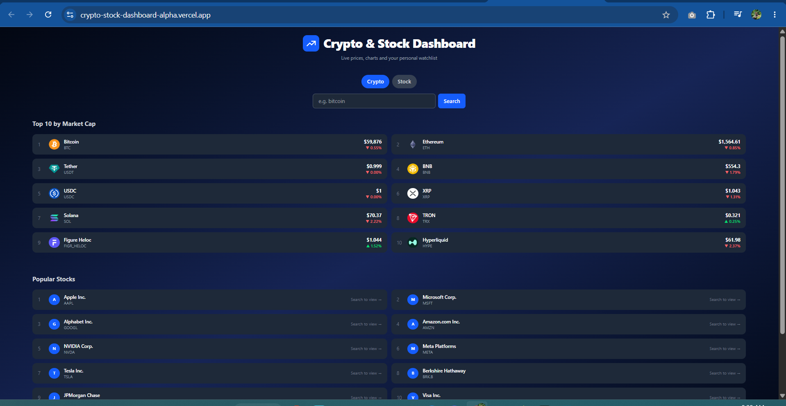

Crypto & Stock Dashboard

A real-time dashboard for tracking live cryptocurrency and stock prices, built with React and powered by the CoinGecko and Alpha Vantage APIs.

**Live Demo:** [https://crypto-stock-dashboard-alpha.vercel.app](https://crypto-stock-dashboard-alpha.vercel.app)

---

Screenshot


---

Features
- Search for any cryptocurrency or stock by name or ticker
- Interactive price charts with 1D, 7D, and 1M timeframes powered by Chart.js
- Live price cards showing current price and 24h percentage change
- Top 10 cryptocurrencies by market cap displayed on the home screen
- Popular stocks list with search guidance
- Personal watchlist saved to localStorage — persists across page refreshes
- Click any watchlist item to instantly reload its chart and price
- Loading skeleton animation while data is being fetched
- Fully responsive — works on mobile, tablet, and desktop
- Smart error messages that guide users to the correct search category

---

Tech Stack
React + Vite - UI framework and build tool
Tailwind CSS - Utility-first styling
Chart.js + react-chartjs-2 - Interactive price charts
Axios - HTTP requests to external APIs
CoinGecko API - Live cryptocurrency data (free, no key required)
Alpha Vantage API - Live stock market data
Vercel - Deployment and hosting

---

Getting Started
Prerequisites
- Node.js v20 or higher
- A free Alpha Vantage API key from [https://www.alphavantage.co/support/#api-key](https://www.alphavantage.co/support/#api-key)

Installation

1. Clone the repository
```bash
git clone https://github.com/davidtiger3622/crypto-stock-dashboard.git
cd crypto-stock-dashboard
```

2. Install dependencies
```bash
npm install
```

3. Create a `.env` file in the root of the project
```bash
VITE_ALPHA_VANTAGE_KEY=your_api_key_here
```

4. Start the development server
```bash
npm run dev
```

5. Open [http://localhost:5173](http://localhost:5173) in your browser

---

Environment Variables
`VITE_ALPHA_VANTAGE_KEY` - Your Alpha Vantage API key for stock data |

> Never commit your `.env` file to GitHub. It is already listed in `.gitignore`.

---

Project Structure

src/

├── components/

   ├── Header.jsx        # App header with icon and title

   ├── SearchBar.jsx     # Search input with Crypto/Stock toggle

   ├── PriceCard.jsx     # Displays current price and % change

   ├── PriceChart.jsx    # Line chart with 1D/7D/1M periods

   ├── TopCoins.jsx      # Top 10 crypto list on home screen

   ├── TopStocks.jsx     # Popular stocks list on home screen

   ├── Watchlist.jsx     # Personal watchlist component

   └── Skeleton.jsx      # Loading skeleton animation

├── services/

   ├── cryptoService.js  # CoinGecko API calls

   └── stockService.js   # Alpha Vantage API calls

├── App.jsx               # Main app component and state management

└── main.jsx              # React entry point

---

Available Scripts

```bash
npm run dev      # Start development server
npm run build    # Build for production
npm run preview  # Preview production build locally
```

---

Author

**David Wafula**
- GitHub: [@davidtiger3622](https://github.com/davidtiger3622)

---

License

This project is open source and available under the [MIT License](LICENSE).
